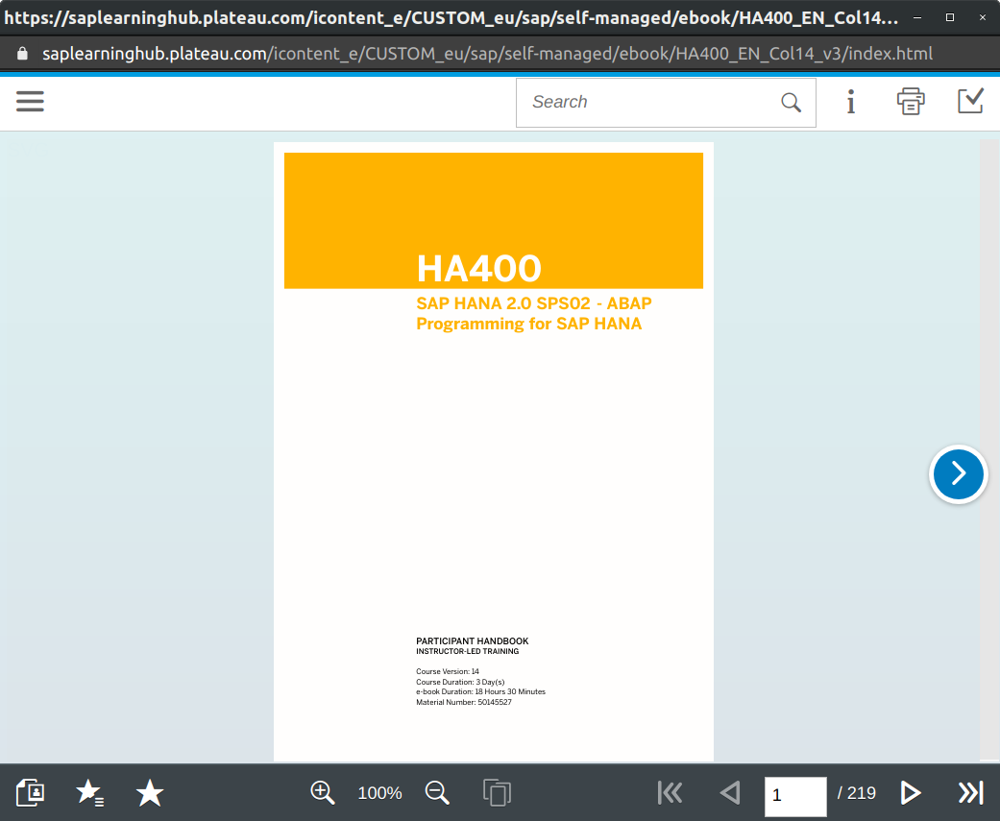

# saplearninghub-pdf-downloader

Download eBook as PDF from SAP Learning Hub.

## Getting Started

## Installation

```bash
npm install
```

## Usage

There are 2 modes :

- CLI
- Config file

They can be mixed. For example you can set the user/password in the config file and set the URL in the CLI. The values from the CLI will override the values from the file.

The download URL of the eBook URL is on the learning hub :



### Config File

Change the file [config.json](config.json) according to your needs.

```bash
npm run build
npm run start
```

### CLI

Here is an example of the possible arguments

```bash
npm run build
npm run start -- --debug="false" --url="https://exmaple.com" --login="SUSER" --password="SUSER_PASSWORD" --target="./target_dir/"
```

## Test

Copy the [config.json](config.json) file into the root of the project with the name `config_test.json`. This file will be use by the test command. It also is gitignored so that no credentials will be committed.

```bash
npm run dev
```

## Build With

- [puppeteer](https://github.com/puppeteer/puppeteer) - Headless Chrome Node.js API
- [pdfkit](https://github.com/foliojs/pdfkit) - A JavaScript PDF generation library for Node and the browser
- [babel](https://github.com/babel/babel) - Babel is a compiler for writing next generation JavaScript.
- [minimist](https://github.com/substack/minimist) - parse argument options
- [nodemon](https://github.com/remy/nodemon) - Monitor for any changes in your node.js application and automatically restart the server - perfect for development

## Contributing

Pull requests are welcome. For major changes, please open an issue first to discuss what you would like to change.

## License

[MIT](https://choosealicense.com/licenses/mit/)
